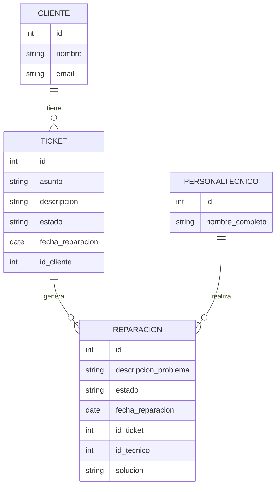

# Documentación Técnica - Módulo de Servicio Técnico

## Herramientas y Tecnologías Utilizadas

- **Backend:** Spring Boot 3.5.5, Java 17, JPA/Hibernate, JWT, Maven
- **Frontend:** React 18, Material UI, JavaScript/ES6, Axios/Fetch
- **Base de datos:**  PostgreSQL/MySQL (producción)
- **Seguridad:** Spring Security, JWT
- **Despliegue:** Docker (opcional), Maven, Node.js/npm
- **Testing:** JUnit, React Testing Library
- **Documentación:** Markdown, Mermaid (diagramas)
- **IDE recomendado:** VS Code, IntelliJ IDEA
- **Control de versiones:** GitHub
---

## Descripción General
Este sistema gestiona el módulo de servicio técnico para la empresa Tigo, permitiendo la administración de tickets de clientes, reparaciones y personal técnico. El sistema está compuesto por microservicios backend en Spring Boot y un dashboard frontend en React.

## Estructura General del Sistema
```
ServicioTecnicoService/
├── msreparaciones/         # Microservicio de reparaciones y técnicos
├── ticketsclientes/       # Microservicio de tickets y clientes
├── tigo-dashboard/        # Frontend React (dashboard)
```

### Diagrama de Arquitectura
```
[    Usuario] → [React Dashboard    ]
   |             |               |
   |             |               |
   v             v               v
[API Gateway] (opcional)         |
   |             |               |
   |             |               |
   v             v               v
[Microservicio TicketsClientes]   [Microservicio MsReparaciones]
```

## Diagrama Entidad-Relación (ER)



*Puedes copiar este diagrama en [Mermaid Live Editor](https://mermaid.live/) para obtener el gráfico visual.*

## Roles de Usuario
- **ADMIN**: Acceso total (gestión de tickets, reparaciones, técnicos, usuarios)
- **MANTENIMIENTO**: Gestión de reparaciones y técnicos
- **USER**: Creación y consulta de tickets

## Endpoints Principales
### TicketsClientes
- `GET /api/tickets` - Listar tickets
- `POST /api/tickets` - Crear ticket
- `PUT /api/tickets/{id}` - Actualizar ticket
- `DELETE /api/tickets/{id}` - Eliminar ticket

### MsReparaciones
- `GET /api/reparaciones` - Listar reparaciones
- `POST /api/reparaciones` - Crear reparación
- `PUT /api/reparaciones/{id}` - Actualizar reparación
- `DELETE /api/reparaciones/{id}` - Eliminar reparación
- `GET /api/tecnicos` - Listar técnicos
- `POST /api/tecnicos` - Crear técnico

## Ejemplo de Uso de la API
```http
# Crear ticket
POST /api/tickets
{
  "asunto": "Samsung S22 no enciende",
  "descripcion": "El equipo no responde al encendido",
  "cliente": "Juan",
  "estado": "Pendiente"
}

# Crear reparación
POST /api/reparaciones
{
  "descripcionProblema": "Cambio de pantalla",
  "asunto": "Samsung S22",
  "estado": "Pendiente",
  "idTicket": 1,
  "idTecnico": 2
}
```

## Autenticación y Seguridad
- El sistema utiliza JWT para proteger los endpoints.
- El token se obtiene al iniciar sesión y se envía en el header `Authorization`.
- Ejemplo:
```http
Authorization: Bearer <token>
```

## Instrucciones Básicas de Uso
1. Iniciar los microservicios con Maven/Java.
2. Ejecutar el dashboard con `npm start`.
3. Acceder con usuario y contraseña según el rol.
4. Gestionar tickets, reparaciones y técnicos desde el dashboard.

## Notas y Recomendaciones
- El sistema puede integrarse con un API Gateway para centralizar rutas y seguridad.
- Los datos de clientes y técnicos pueden ampliarse según necesidades futuras.
- Consultar el código fuente para detalles de validaciones y lógica de negocio.

---
*Esta documentación es exclusiva para el módulo de servicio técnico.*

